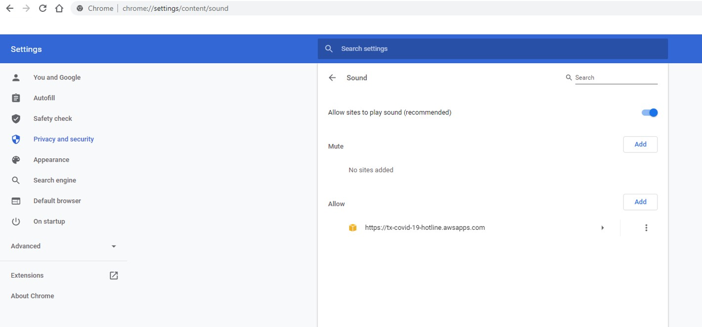

I have reached the Chrome Page.

<b>Make sure that Amazon Connect has permission to play sounds.</b>

Copy the below link in a new Chrome tab.
chrome://settings/content/sound

Make sure that "Allow sites to play sound" is On.

Make sure that Amazon Connect link is not listed in the Mute section.

Add the following link to the Allow section:
<b>Insert link here</b>

<b>Make sure that Amazon Connect has permission to the microphone.</b>

Copy the below link in a new Chrome tab.
chrome://settings/content/microphone

Verify that there is nothing in the Block section.

Verify that the following is in the Allow section:
<b>Insert link here</b>