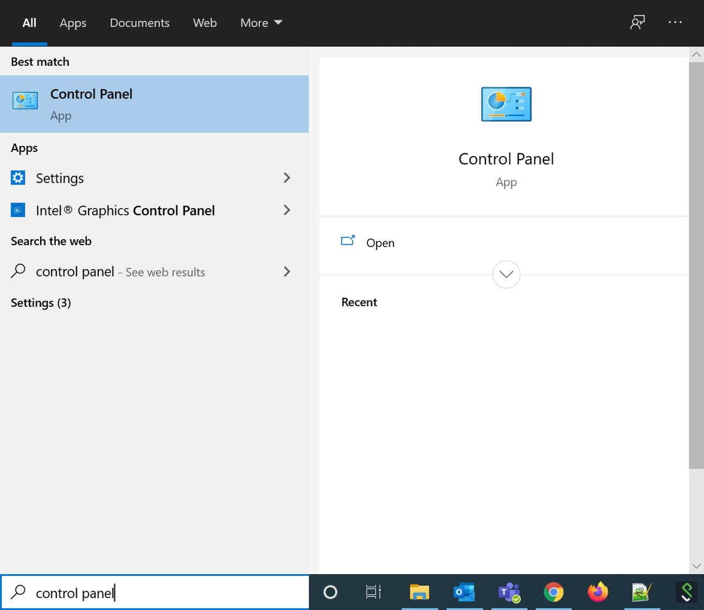

<h1 id="unable_hear_claimant">I am unable to hear the claimant</h1>

<h2 id="exclusive_control">Make sure Teams can’t take exclusive control of the speaker.</h2>
 
1. Search for Control Panel in the Windows search bar and open it up

2. In the top right, switch to View by: Large icons

3. Double-click: Sound 

4. On Playback tab, right click the active output device (the headset you are using)

5. Go to Properties

6. Go to Advanced tab and Uncheck "Allow applications to take exclusive control of this device".

7. Click OK

 
 
<h2 id="browser_permission_sound">Check if your browser has permission to play sounds</h2>
1. In the Cortana search bar, search for “Sound mixer options”

2. Ensure that Chrome and/or Firefox is unmuted.

3. Change the input of the browser to your microphone.

4. Change the output of the browser to your headset.

 
 
