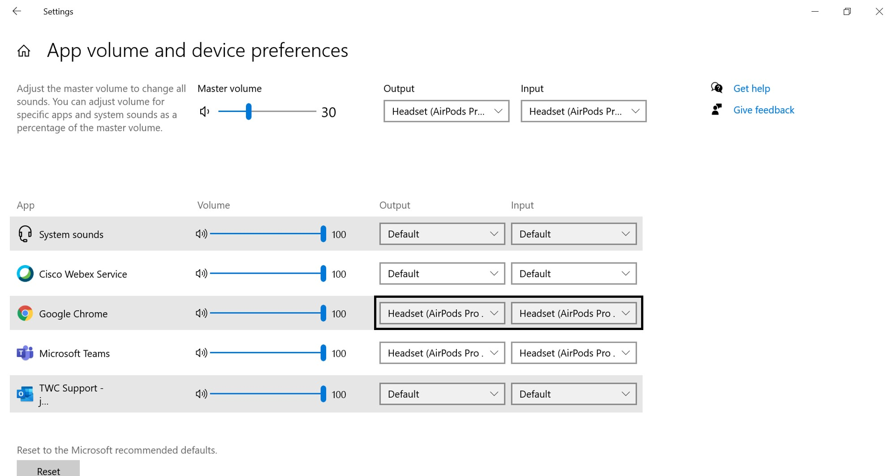

<h1 id="unable_hear_claimant">I am unable to hear the claimant</h1>

Make sure Teams can’t take exclusive control of the speaker.

1. Search for Control Panel in the Windows search bar and open it up

2. In the top right, switch to View by: Large icons

3. Click on Sound

4. On Playback tab, right click the active output device (for example, in the below screenshot, the active device with the green checkmark is the Airpods Pro)

5. Go to Properties

6. Go to Advanced tab and Uncheck "Allow applications to take exclusive control of this device".

7. Click OK

Check if Windows sound settings for your browser is configured to use your headset.

1. In the Windows search bar, search for “Sound mixer options”

2. Ensure that your browser setting is unmuted and at a sufficient volume level (below screenshot is for Chrome, if you are using different browser such as Firefox, make sure that is unmuted)

3. Change the input and output of the browser to your specific headset (example below is for AirPods, yours may be different)

4. Also make sure the master volume is unmuted, at a sufficient volume level, and the input/output set to your headset (example below is for AirPods, yours may be different)

If you are using Chrome, check that the call center URL is in the Allow section of the Chrome sound settings.

1. 

If you are using Firefox, ensure that the browser sound settings are configured for the call center URL.

1.

